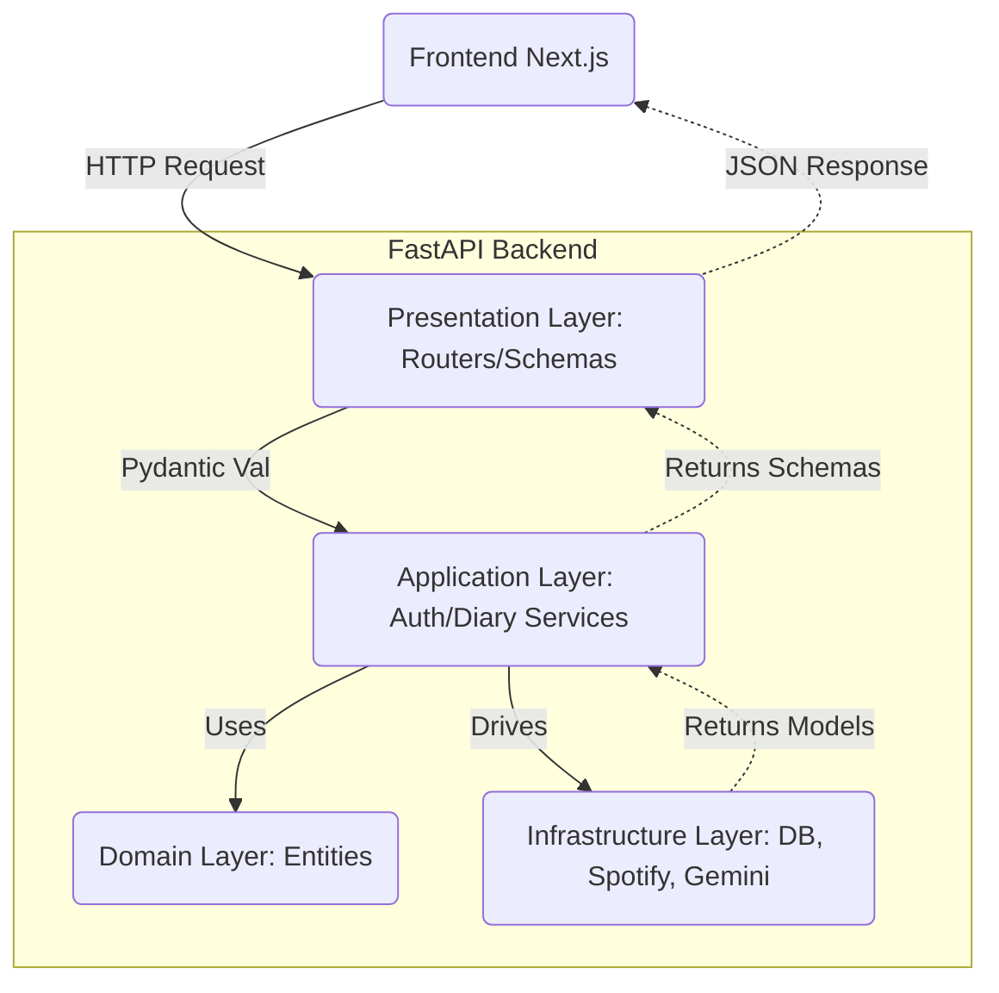

# Auditory Diary (Musitory) - Comprehensive Project History & Handoff

이 문서는 프로젝트 **Day 1부터 현재까지** 전체 기획안, 기술 스택, 시스템 아키텍처 및 구현된 모든 기능(Phase 1 ~ Phase 5)을 아우르는 **종합 프로젝트 맥락(Context)** 문서입니다. 새로운 에이전트나 개발자가 투입되었을 때, 이 문서 하나만으로 프로젝트의 A to Z를 완벽히 인지할 수 있도록 작성되었습니다.

---

## 1. 프로젝트 개요 (Overview)
**Auditory Diary (가칭: Musitory)**는 사용자가 Spotify에서 들은 음악을 기반으로, 그 순간의 날씨와 감정을 결합해 자동으로 **청각적 일기(오디오 모먼트)**를 기록해 주는 서비스입니다. 
- **초점:** 사용자의 수동적 기록 최소화 (Spotify 자동 연동)
- **디자인 컨셉:** 물리적인 LP, 카세트 테이프, 바이닐 레코드의 질감을 살린 **모던 스큐어모피즘(Modern Skeuomorphism)**과 글래스모피즘(Glassmorphism)의 결합.

---

## 2. 기술 스택 (Tech Stack)
### Backend (FastAPI)
- **Framework:** FastAPI, Python (Strict Type Hinting via Pydantic)
- **Architecture:** Domain-Driven Design (DDD) 기반 4-Tier Architecture (Presentation, Application, Domain, Infrastructure)
- **Database:** SQLite (로컬 개발용, `aiosqlite`) / SQLAlchemy ORM
- **Authentication:** JWT, Google OAuth, Spotify OAuth
- **External APIs:** Spotify Web API, Gemini API (AI 요약), (날씨는 현재 Mock 처리 중)

### Frontend (Next.js)
- **Framework:** Next.js (App Router), TypeScript
- **Styling:** Tailwind CSS, `clsx`, `tailwind-merge`
- **UI Components & Animation:** Framer Motion, Aceternity UI, Magic UI (Aurora Background, Bento Grid, Sticky Scroll 등)
- **Features:** html2canvas (이미지 다운로드)

---

## 3. 구현 히스토리 (Phase 1 ~ 5)
현재 프로젝트의 모든 초기 기획 5단계가 **100% 개발 완료**된 상태입니다. (`todo.md` All Checked)

### ✅ Phase 1: 기본 인프라 설비 및 연동
- [Backend] DDD 구조의 폴더 스캐폴딩 설정. (domain, application, presentation, infrastructure)
- [Backend] Google OAuth 로그인 연동 파이프라인 완성. (프론트에서 Token을 받아 백엔드에서 자체 JWT로 교환)
- [Backend] Spotify 계정 연동 및 DB에 토큰 저장 (`/api/auth/spotify/login`, `/callback`)
- [Data] DB 스키마 기초(Users, Tracks, Contexts, AuditoryDiary) 정의. `Base.metadata.create_all`을 통한 로컬 DB 매핑.

### ✅ Phase 2: Frontend UI/UX 기초 및 디자인 시스템
- [Frontend] Aceternity UI 컴포넌트 환경 셋업 (`cn` 유틸 세팅).
- [Frontend] 메인 대시보드 (`DashboardClient.tsx`)의 기본 타임라인 디자인.
- Spotify 로고 및 LP/바이닐 레코드 메타포가 들어간 애니메이션 컴포넌트 구성.

### ✅ Phase 3: 랜딩 페이지 (Musitory LP) 완성
- [Frontend] 랜딩 페이지 (`app/page.tsx`) 전면 리디자인:
  - **Hero:** Aurora Background를 통한 사운드웨이브 감성의 첫인상.
  - **Features:** Bento Grid를 이용한 핵심 기능 시각적 배치.
  - **Flow:** Sticky Scroll Reveal 컴포넌트로 (로그인 -> 연동 -> 감상) 사용자 여정 인터랙션 안내.

### ✅ Phase 4: 과거 기록 조회 (History & Calendar Timeline)
- [Backend] `/api/diaries/history`: KST(한국 표준시) 기준 자정~자정 범위로 UTC 시간을 변환하여, 특정 날씨의 타임라인 기록만 정확하게 불러오는 격리 로직 적용. (Timezone 이슈 Root Cause 해결)
- [Frontend] 대시보드 상단에 좌우 가로 스크롤형 **미니 캘린더** 배치. 날짜 칩을 누르면 하단 타임라인이 과거의 기록으로 변경됨.
- [Frontend] 기록이 없는 날짜를 위한 감성적인 "Empty State" UI 추가.

### ✅ Phase 5: AI Daily Capsule (하루 일기 생성 및 캡처)
- [Backend] `DailyCapsuleORM` DB 테이블 신설.
- [Backend] 구글 **Gemini API**(`gemini-2.0-flash-lite`) 연동 (`ai_client.py`). 그날 들은 곡의 정보와 날씨를 바탕으로 감성적인 1~2문장의 '하루 한 줄 평'을 생성. `ResourceExhausted`(무료 할당량 고갈)을 대비한 재시도 로직 및 우아한 Fallback Mock 문장 체계 구현.
- [Backend & Frontend] html2canvas가 Spotify CDN의 이미지를 캡처할 때 발생하는 CORS Taint 현상 우회를 위한 **백엔드 HTTP Image Proxy 엔드포인트**(`/api/capsules/image-proxy`) 신설. 프론트의 카드 렌더링 시 강제 `crossOrigin="anonymous"` 속성 주입.
- [Frontend] 타임라인 상단 풀스크린 **Dimmer 모달 오버레이** 구조로 AI 캡슐 애니메이션 및 다운로드(인스타 스토리 비율) 구현 완료.

---

## 4. 백엔드 아키텍처 다이어그램 (DDD Focus)
백엔드는 복잡성을 제어하기 위해 4-Tier DDD 원칙을 엄격하게 지키고 있습니다.

---

## 5. 지켜야 할 내부 그라운드 룰 (Developer Guidelines)
1. **The Three-Step Rule:**
   - 작업 전 도메인 용어(Ubiquitous Language) 재정의
   - 코드 작성 전 4계층 DDD에 맞춘 파일 구조/흐름 계획 컨펌
   - 승인 후 점진적 코드 작성
2. **KST Timezone 원칙:**
   - DB에 저장되는 모든 시간은 `UTC` 이지만, API 필터링이나 클라이언트 렌더링 시 개념적인 "하루"의 기준은 항상 **KST(Asia/Seoul, UTC+9)**여야 함.
3. **LLM Error Fallback Rule:**
   - 외부 AI 의존성(Gemini)이 있는 기능은 **무조건** 쿼터 고갈(HTTP 429)이나 API 서버 다운을 가정해야 함. AI가 죽어도 서비스 Flow(UI)가 박살나지 않도록 Mock Data Fallback 로직이 필수.
4. **CORS & Proxy Rule:**
   - `html2canvas` 등을 이용한 프론트단 캡처 기능이 들어갈 때 외부 CDN 이미지(Spotify 등)는 반드시 백엔드 Proxy를 통과시키고, img 태그에 `crossOrigin="anonymous"` 속성을 달 것.

---

## 6. 결론 및 Next Action
Phase 1~5까지의 핵심 MVP(Minimum Viable Product)는 완벽히 구축되었습니다.
다음 투입된 에이전트/개발자는 이 문서를 바탕으로, **배포(Production) 준비, 성능 최적화(Refactoring), 혹은 Phase 6(소셜 네트워킹/알림 기능 등) 기획**을 이어나가면 됩니다.
